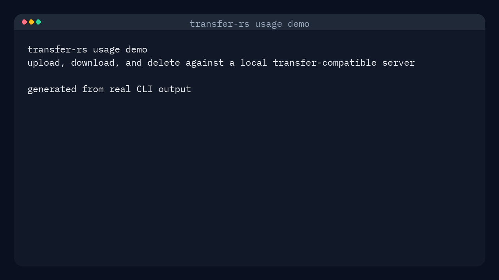

# transfer-rs

transfer-rs is a Rust CLI for transfer.sh-compatible file sharing servers. It supports uploads, downloads, remote deletion, a local SQLite-backed history view, and optional end-to-end encryption using age passphrases or a locally generated age identity.

The default server is `https://transfer.sh`, and you can override it globally with `--server` or persist a different default in the generated config file.

## Demo



## Features

- Upload files to a transfer.sh-compatible server.
- Download files by URL, with automatic filename inference.
- Delete remote uploads later using a stored record ID or download URL.
- Browse upload history in a terminal UI.
- Encrypt uploads with an age passphrase.
- Encrypt uploads with a local age identity stored on disk.
- Track upload metadata, delete URLs, timestamps, and encryption mode in SQLite.

## Requirements

- Rust toolchain with Cargo.
- Access to a transfer.sh-compatible server.
- A terminal when using passphrase prompts or the history TUI.

## Build And Run

```bash
cargo build --release --locked
cargo test --lib --bins --locked
cargo run -- --help
cargo run -- --version
```

## Pre-commit Hooks

Install `pre-commit` with `pre-commit-uv` so hook environments are managed by `uv`:

```bash
uv tool install pre-commit --with pre-commit-uv --force-reinstall
pre-commit install
```

Run the full hook set on demand with:

```bash
pre-commit run --all-files
```

The repository hook set includes basic file hygiene checks plus `cargo fmt --all -- --check`, `cargo clippy --locked --all-targets --all-features -- -D warnings`, and `cargo test --locked --lib --bins`.

To install the binary into your Cargo bin directory from the current checkout:

```bash
cargo install --path .
```

## Usage

Show top-level help:

```bash
transfer-rs --help
```

Upload a file:

```bash
transfer-rs upload ./report.pdf
```

Upload with a custom remote name and transfer limits:

```bash
transfer-rs upload ./report.pdf --remote-name release-notes.pdf --max-days 7 --max-downloads 3
```

Upload with passphrase encryption:

```bash
transfer-rs upload ./secrets.txt --passphrase
```

Upload with local identity-based encryption:

```bash
transfer-rs upload ./backup.tar --identity
```

Download a file and let the tool infer the output name:

```bash
transfer-rs download https://example.invalid/report.pdf
```

Download to an explicit path:

```bash
transfer-rs download https://example.invalid/report.pdf --output ./downloads/report.pdf
```

Download an encrypted payload with identity decryption:

```bash
transfer-rs download https://example.invalid/backup.tar.age --identity
```

Open the interactive history view:

```bash
transfer-rs history
```

Show deleted entries as well:

```bash
transfer-rs history --show-deleted
```

Delete a remote file by stored record ID or by its download URL:

```bash
transfer-rs delete 9d52f8cc-aaaa-bbbb-cccc-1234567890ab
transfer-rs delete https://example.invalid/report.pdf
```

Override the configured server for any command:

```bash
transfer-rs --server https://transfer.example.com upload ./report.pdf
```

Show the application version:

```bash
transfer-rs --version
```

## CI And Releases

GitHub Actions builds the project on Linux, Windows, and macOS for pushes to `main` and pull requests.

To prepare a release in GitHub Actions, run the manual `Prepare Release PR` workflow and provide the next version number without the leading `v`.

The workflow updates `Cargo.toml` and `Cargo.lock`, regenerates `demo/usage-demo.mp4` and `demo/usage-demo.gif`, generates `release-notes/vX.Y.Z.md`, uploads those files as workflow artifacts, and opens a `chore(release): prepare vX.Y.Z` pull request for review.

After you review the generated release notes and demo in that PR, merge it into `main`. A follow-up workflow tags the merged commit as `vX.Y.Z`, and the release workflow publishes the GitHub release from that reviewed tag using the checked-in `release-notes/vX.Y.Z.md` file when present.

If you want the same flow locally, run:

```bash
./scripts/release.sh 1.0.1
```

The script requires a clean repository, updates `Cargo.toml` and `Cargo.lock`, regenerates `demo/usage-demo.mp4` and `demo/usage-demo.gif`, creates a `chore(release): cut vX.Y.Z` commit, and creates an annotated `vX.Y.Z` tag. Push the commit and tag separately when ready.

The release workflow builds release archives for Linux, Windows, and macOS, then publishes the tagged GitHub release.

## Encryption Modes

`--passphrase` encrypts uploads with age scrypt passphrase encryption. The passphrase is prompted on the terminal and is not stored in the local config or history database.

`--identity` encrypts uploads using a locally generated age x25519 identity. The private key is created on first use and reused for later identity-encrypted downloads.

If you download a URL that already exists in local history, transfer-rs reuses the recorded encryption mode and original filename. If there is no local history entry and the URL ends in `.age`, the tool assumes passphrase decryption unless you explicitly pass `--identity`.

## Local State

transfer-rs creates platform-specific application directories through the `directories` crate and stores three files there:

- `config.toml` stores the default `server_url`.
- `history.sqlite3` stores upload history, delete URLs, timestamps, and encryption metadata.
- `identity.agekey` stores the local age identity used by `--identity` mode.

The initial config file is created automatically with this default content:

```toml
server_url = "https://transfer.sh"
```

Protect the generated identity key like any other private key. Anyone who obtains it can decrypt files encrypted for that identity.

## History TUI

The `history` command opens a ratatui-based interface backed by the local SQLite database.

- `j` or Down moves selection down.
- `k` or Up moves selection up.
- `c` copies the selected download URL to the clipboard.
- `d` deletes the selected remote file and marks the local record as deleted.
- `x` removes the local history record without contacting the server.
- `q` quits the interface.

## Server Compatibility

The server must behave like transfer.sh for the paths used here:

- Uploads are sent as `PUT /<remote-name>`.
- The response body must contain the download URL.
- The response must include an `X-Url-Delete` header.
- Downloads use `GET <download-url>`.
- Deletes use `DELETE <delete-url>`.

## License

This project is licensed under the MIT License. See the `LICENSE` file for the full text.
